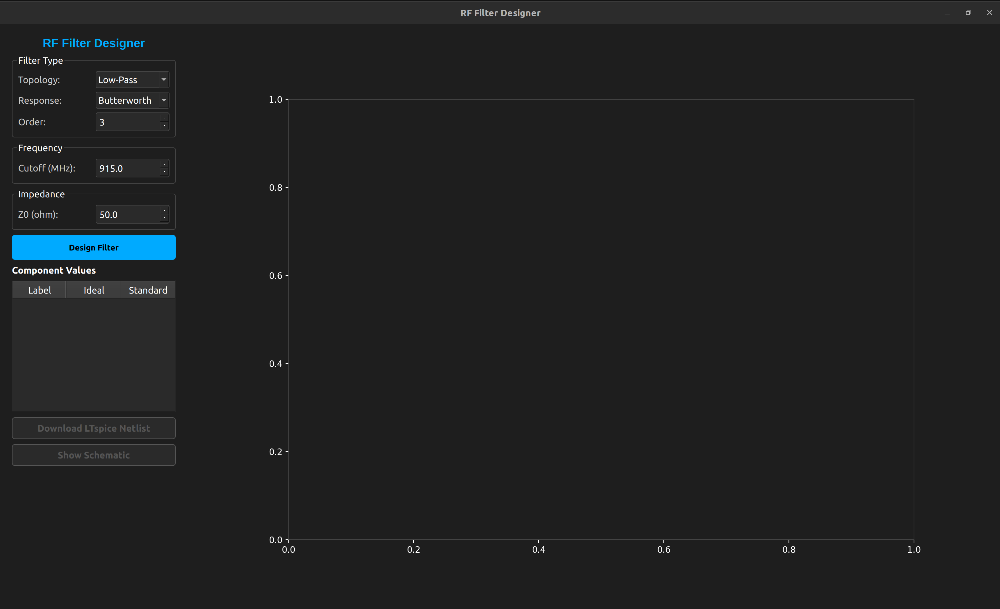
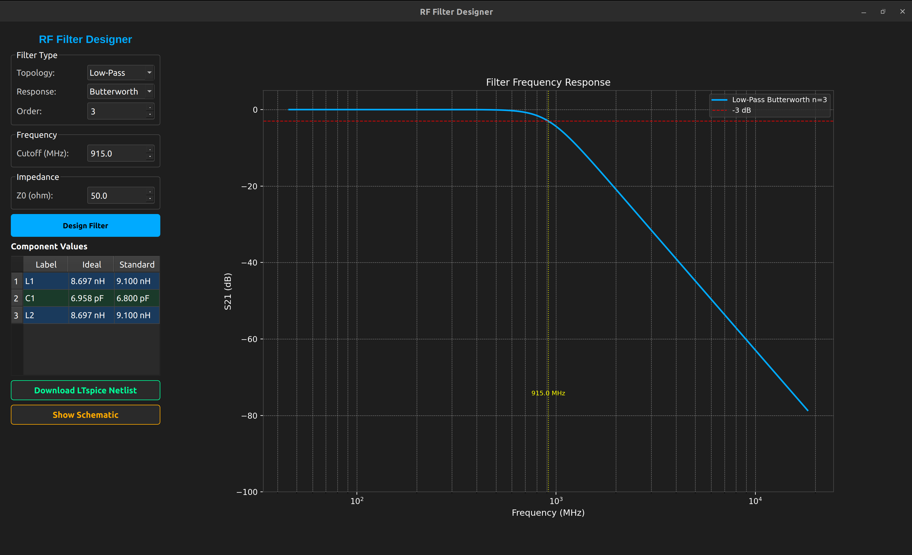
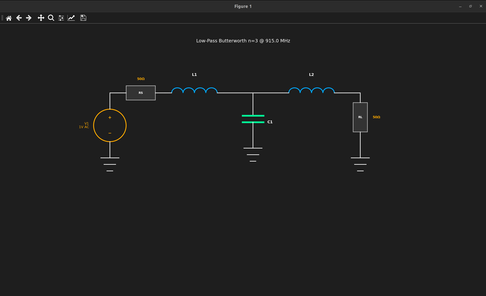
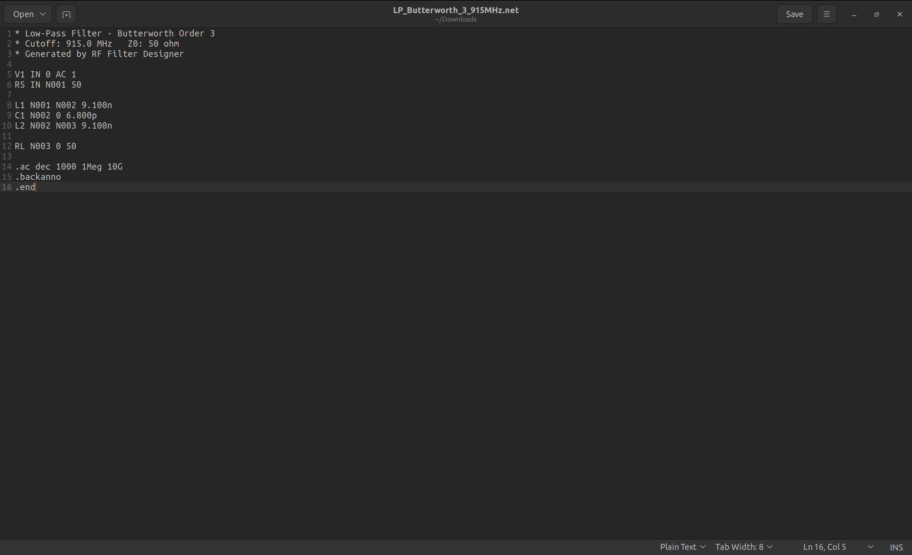

# RF Filter Designer

A Python desktop application for designing LC ladder filters for RF circuits.
Built with PyQt6, NumPy, SciPy and Matplotlib.

Designed with LoRa radio boards in mind (915 MHz, 868 MHz, 433 MHz ISM bands)
but works for any RF filter design application.

---

## Screenshots

### Main Window


### After Designing a Filter


### Schematic View


### LTspice Netlist Output


---

## Features

- Low-pass, high-pass and band-pass filter topologies
- Butterworth, Chebyshev (0.5 dB) and Bessel response types
- Filter orders 1 through 9
- Automatic component value snapping to E24 standard series
- S21 frequency response plot with -3 dB reference line
- Component value table showing ideal vs standard values
- Ladder network schematic with voltage source and resistors
- LTspice netlist export (.net) with descriptive filename

---

## How It Works

The design process follows standard RF filter theory:

1. Normalized g-values are looked up from prototype tables (Butterworth, Chebyshev, Bessel)
2. g-values are scaled to real inductor and capacitor values using the cutoff frequency and system impedance
3. Calculated values are snapped to the nearest E24 standard component
4. The frequency response is simulated using ABCD transmission matrices
5. S21 is computed and plotted in dB

---

## Installation

### Requirements

- Python 3.10 or higher
- PyQt6
- NumPy
- SciPy
- Matplotlib

### Install Dependencies
```bash
pip install PyQt6 numpy scipy matplotlib
```

### Run the Application
```bash
python main.py
```

---

## Project Structure
```
rf_filter_designer/
│
├── main.py                  # entry point
│
├── filters/
│   ├── prototypes.py        # g-value tables
│   ├── lowpass.py           # low-pass scaling
│   ├── highpass.py          # high-pass scaling
│   └── bandpass.py          # band-pass scaling
│
├── components/
│   └── eseries.py           # E24 standard value snapping
│
├── simulation/
│   └── abcd.py              # ABCD matrix simulation and S21 plot
│
├── schematic/
│   └── draw.py              # ladder network schematic drawing
│
├── export/
│   └── ltspice.py           # LTspice netlist generator
│
└── gui/
    └── main_window.py       # PyQt6 main window
```

---

## Usage

1. Select a filter topology (Low-Pass, High-Pass, Band-Pass)
2. Select a response type (Butterworth, Chebyshev, Bessel)
3. Set the filter order (higher order = steeper rolloff = more components)
4. Enter the cutoff frequency in MHz
5. Set the system impedance (50 ohm for most RF applications)
6. Click **Design Filter**
7. Click **Show Schematic** to view the ladder network diagram
8. Click **Download LTspice Netlist** to export and simulate in LTspice

---

## LoRa Notes

For LoRa harmonic suppression filters:

- US band: 915 MHz cutoff
- EU band: 868 MHz cutoff
- 433 MHz band: 433 MHz cutoff
- Use Chebyshev n=5 for best harmonic rejection
- Keep PCB traces short and add ground vias around the filter
